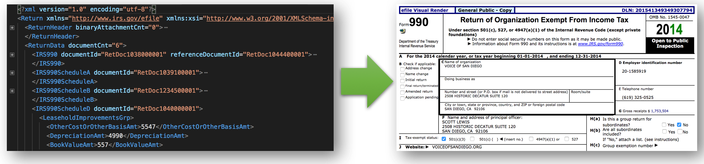

# IRS e-File Viewer

In June 2016, the [IRS released](https://aws.amazon.com/blogs/publicsector/irs-990-filing-data-now-available-as-an-aws-public-data-set/) over a million electronic 990 filings (nonprofit annual tax filings) as XML documents. These filings are accessible on [AWS](https://aws.amazon.com/public-datasets/irs-990/).

This utility allows users to visualize individual 990 XML filings in a format representing a standard IRS form.



## Project Structure
The IRS publishes stylesheets that can be used to transform an XML document into HTML. Specifically, these XSLT (eXtensible Stylesheet Language Transformation) files are distributed each year by the IRS so that tax preparers can generate tools that submit tax filings in the proper format. The [/mef](/mef) directory contains the full set of stylesheets provided by the IRS. However, since only the form 990s and related schedules are available, these are the only ones used by this utility.

Standard libraries exist to execute XML transformations; however, modern browsers are also able to execute these tranformations natively. Preventing the need for backend processing, all XML modifications and transformations are applied client-side in the browser. Thus, this utility is able to hosted as a static site.

This repository is configured as a Jekyll project in order to support the relative links that exist throughout the IRS stylesheets. These links need to be processed through Jekyll in order to route properly, so a number of the stylesheets have been modified to include Jekyll front matter and variables.

## Setup
**Dependencies**: git, Ruby, Bundler Rubygem

```
gem install bundler
cd /path/to/repository
bundle install
```

## Develop
`bundle exec jekyll serve --config _config.yml,_config.dev.yml --incremental`

## Compatibility
This application is designed to work on the most recent versions of major browsers (Chrome, Firefox, Safari, Edge), as well as IE11.
